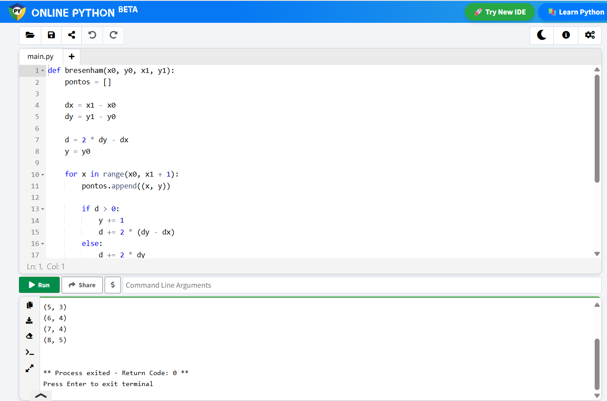

# Algoritmo de Bresenham 

Este repositório contém uma implementação em Python do algoritmo de **Bresenham para rasterização de segmentos de reta**, utilizado na disciplina de Computação Gráfica.

Aluna: Lara Vitória Silva Santos Barros

## 📌 Descrição

O algoritmo de Bresenham permite converter uma reta vetorial contínua em coordenadas inteiras que correspondem aos **pixels** mais próximos da linha. Ele é **eficiente**, usa **apenas operações inteiras** e evita erros de arredondamento.

Este exemplo desenha uma linha entre os pontos (1, 1) e (8, 5), conforme atividade da disciplina de **Computação Gráfica**.

## 🔢 Exemplo de Saída

Para os pontos (1, 1) até (8, 5), a saída é:

(1, 1)
(2, 2)
(3, 2)
(4, 3)
(5, 3)
(6, 4)
(7, 4)
(8, 5)


## 🚀 Como Executar na sua máquina

1. Clone o repositório:
   ```bash
   git clone https://github.com/laravitoriabarros/atividade01-bresenham.git

2. Execute o programa

    ```bash
    python bresenham.py

## 🚀 Como executar online

1. Acesse https://www.online-python.com/rILyA64YQa 

2. Clique no botão verde "run"


